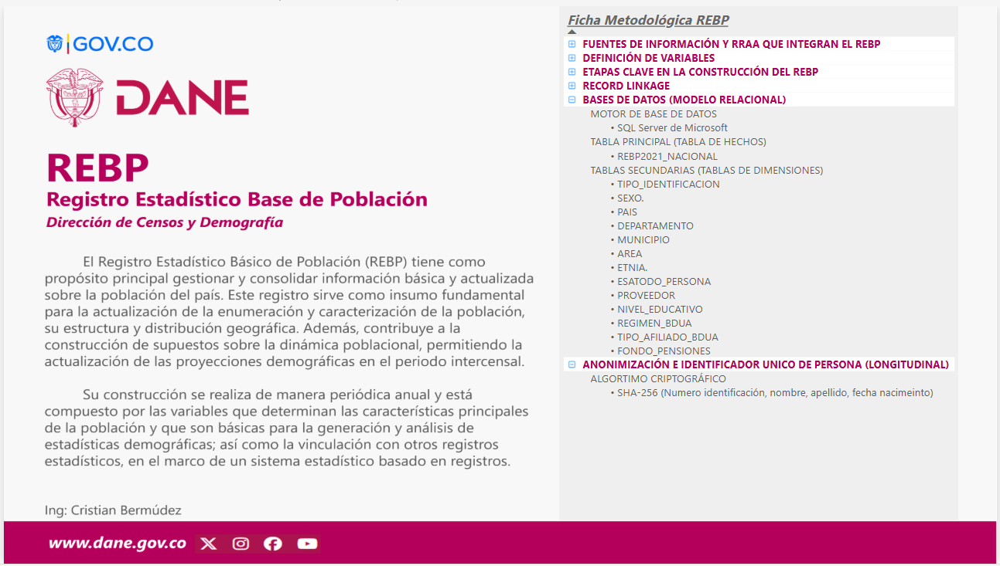
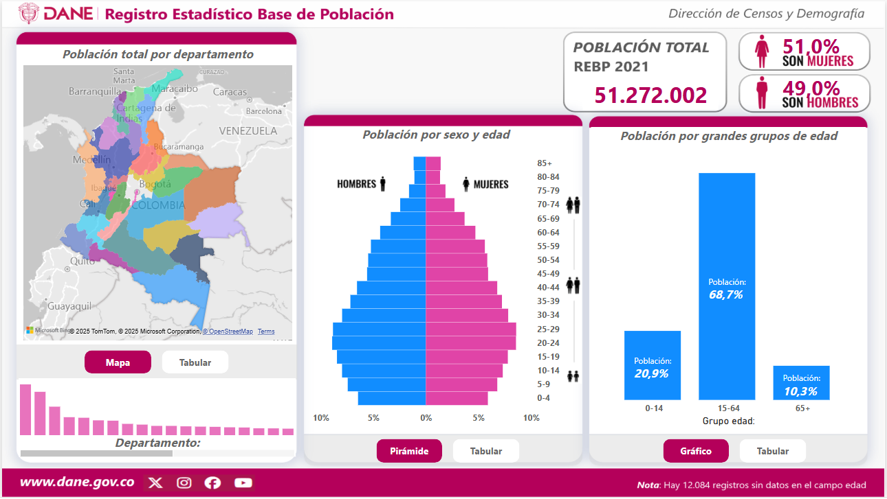

# Registro Estadístico Base de Población con Power BI Desktop

Proyecto para el análisis y visualización estadística desarrollado en Power BI Desktop con datos provenientes del Registro Estadístico Base de Población (REBP) del DANE. Las tablas utilizadas son agregadas, anonimizadas y no contienen información sensible. El proyecto demuestra buenas prácticas para el análisis visual utilizando exclusivamente Power BI, sin requerir programación ni procesos ETL externos.


## Tabla de contenido

- [Objetivo del proyecto](#objetivo-del-proyecto)
- [Estructura del proyecto](#estructura-del-proyecto)
- [Metodología](#metodología)
  - [Modelado de datos](#modelado-de-datos)
  - [Diseño de visualizaciones](#diseño-de-visualizaciones)
  - [Actualización de datos](#Actualización-de-datos)
  - [Publicación del informe](#publicación-del-informe)
- [Software requerido e instalación](#software-requerido-e-instalación)
- [Licencia](#licencia)


## Objetivo del proyecto

Este proyecto utiliza información agregada del Registro Estadístico Base de Población (REBP) para visualizar características demográficas de la población en Colombia. El REBP consolida datos clave para la caracterización poblacional, su distribución geográfica y proyecciones intercensales. El objetivo es facilitar el análisis visual e interactivo de estadísticas demográficas en el país para la toma de decisiones informadas.


## Estructura del proyecto

```
/registro-poblacion-powerbi/
│
├── datos_excel/              # Tablas en Excel utilizadas como fuente
│   ├── Departamentos.xlsx
│   ├── Rebp_Informacion.xlsx
│   ├── Rebp_Proyecciones.xlsx
│   ├── Rebp2018-2021.xlsx
│   ├── Rebp2021_Piramide.xlsx
│   └── Rebp2021_Dpto_Residencia.xlsx
│
├── modelo_powerbi/           # Archivo .pbix con el modelo de datos y dashboard
│   └── dashboard_poblacion.pbix
│
├── capturas/                 # Imágenes de referencia del informe
│   ├── introduccion_rebp.png
│   └── resumen_dashboard.png
│
├── plantillas/               # Archivos de apoyo en PowerPoint (fondos, diseños visuales)
│   └── plantilla_rebp.pptx
│
├── README.md                 # Documentación del proyecto
└── LICENCIA                  # Términos de uso (MIT)
```


## Metodología

### Modelado de datos
- Importación de datos desde tablas Excel.
- Creación de relaciones entre tablas (modelo estrella).
- Definición de campos calculados, columnas derivadas y tabla calculada adicional utilizando expresiones DAX.

### Diseño de visualizaciones
- Elección de gráficos adecuados (barras, lineal, piramides, tarjetas, segmentadores, etc).
- Aplicación de filtros por dimensiones: sexo, región, grupos de edad, etc.
- Uso de herramientas de formato condicional y colores institucionales.
- Implementación de botones interactivos para alternar entre vistas gráficas y tabulares, mejorando la navegación y experiencia del usuario

### Actualización de datos
- El modelo permite actualizar los datos de forma automática desde los archivos Excel vinculados mediante la funcionalidad de actualización de Power BI Desktop.
- Power BI Desktop detecta los cambios en las fuentes y actualiza las visualizaciones sin necesidad de reconstruir el dashboard.
- Esta funcionalidad permite mantener la información vigente de forma eficiente.

Además, si se publica en Power BI Service con una cuenta con licencia Pro o Premium, es posible configurar una **actualización programada**, lo que permite mantener el informe actualizado sin intervención manual.

Esta funcionalidad facilita mantener la información vigente y coherente con la evolución de los registros originales, y es especialmente útil cuando se trabaja con datos periódicos como series anuales o poblacionales. 

### Publicación del informe
- Guardado del archivo en formato .pbix.
- Opcion 1: Publicación en Power BI Service para acceso en la nube (Recomendado).
- Opcion 2: Exportación como informe estático (PDF, PowerPoint).


## Software requerido e instalación

### Requisitos:
- Power BI Desktop (versión actual)
- Microsoft Excel (para edición de archivos fuente)

### Instrucciones:
1. Descargar e instalar Power BI Desktop desde [powerbi.microsoft.com](https://powerbi.microsoft.com/).
2. Clonar este repositorio o descargarlo como ZIP.
3. Abrir el archivo `dashboard_poblacion.pbix` en Power BI Desktop.
4. (Opcional) Sustituí los archivos Excel dentro de la carpeta datos_excel/ con tus propios datos, asegurándote de mantener la estructura de columnas y nombres de hoja para que el modelo funcione correctamente.


## Vista previa del informe

A continuación, se muestran capturas representativas del informe desarrollado en Power BI para el Registro Estadístico Base de Población:

### Introducción al REBP



### Resumen del dashboard




## 🛡️ Badges del proyecto

 
 


## Licencia

Este proyecto se distribuye bajo la licencia MIT. Puede ser utilizado con fines educativos y de referencia, citando la fuente original.
